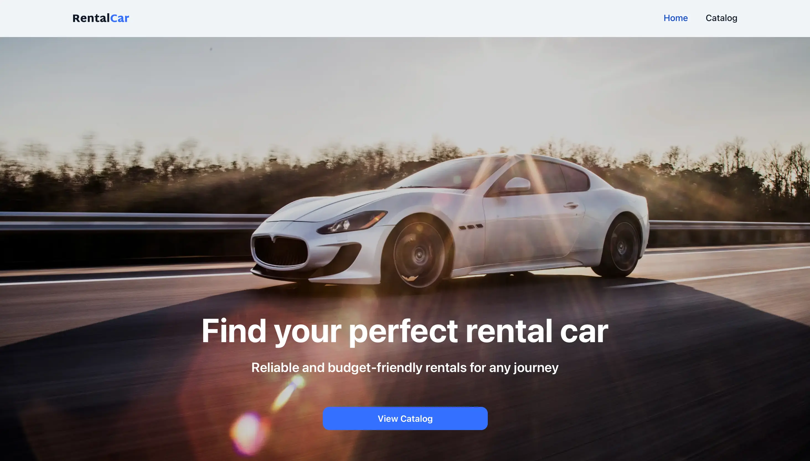

# RentalCar

RentalCar is a frontend web application for a car rental company. It allows
users to browse available cars, filter results, view detailed information about
each vehicle, and submit a booking request.

## Preview



## Live Demo

[Live Demo](https://rental-car-murex-tau.vercel.app/)

## GitHub Repository

[GitHub Repository](https://github.com/Romanna-Brych/Rental-Car)

## Features

- Home page
- Catalog page with available cars
- Filtering by brand, rental price, and mileage
- Paginated car list
- Detailed page for each car
- Booking form with validation
- User-friendly interface

## Tech Stack

- Next.js
- TypeScript
- React
- TanStack Query
- Axios
- Zustand
- Yup
- React DatePicker
- CSS Modules

## Pages

- `/` — Home page
- `/catalog` — Catalog page with filters and car list
- `/catalog/[id]` — Detailed information about a selected car

## Installation and Setup

1. Clone the repository:

```bash
git clone https://github.com/Romanna-Brych/Rental-Car.git
```

2. Navigate to the project folder:

```bash
cd Rental-Car
```

3. Install dependencies:

```bash
npm install
```

4. Create a .env.local file:

NEXT_PUBLIC_BASE_URL=your_api_url

5. Start the development server:

```bash
npm run dev
```

6. Open the app in your browser:

```bash
http://localhost:3000
```

## Author

Romanna Brych
